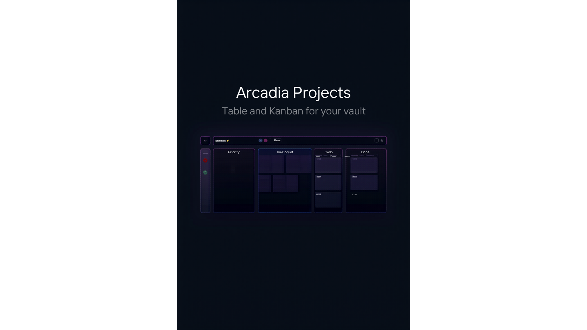

# Arcadia Projects

Multi-view project management for Obsidian: visualize your vault notes as a Table or Kanban board, with real-time sync to your note metadata.

## Features

### Free
- Table view showing notes as a sortable spreadsheet with YAML frontmatter columns
- Kanban view for drag-and-drop task management driven by a status field
- Basic filtering by folder, tag, or frontmatter value
- Live data sync: changes to notes update the view instantly
- Switch views via command palette or the view header controls

### Premium
- Calendar view mapping notes to dates
- Gallery view for image-rich or card-style collections
- Timeline view for date-range project planning
- Portfolio view for high-level project dashboards
- Advanced filter and sort combinations with saved presets
- CSV export of any view
- Get Premium at [arcadia-studio.lemonsqueezy.com](https://arcadia-studio.lemonsqueezy.com)

## Installation

1. Open Obsidian Settings
2. Go to Community Plugins and disable Safe Mode
3. Click Browse and search for "Arcadia Projects"
4. Install and enable the plugin

## Manual Installation

1. Download the latest release from [GitHub Releases](https://github.com/Arcadia-Studio/obsidian-arcadia-projects/releases)
2. Extract to your vault's `.obsidian/plugins/arcadia-projects/` folder
3. Reload Obsidian and enable the plugin

## Usage

Open the Projects view via the ribbon icon (layout-dashboard) or the "Open Project View" command. Use "Switch to Table View" and "Switch to Kanban View" commands to change the active view from anywhere in Obsidian.

The Kanban view groups notes by a configurable frontmatter field (default: `status`). Set a `status` field in your note YAML and Arcadia Projects will place it in the matching column automatically.

## Premium License

Arcadia Projects uses a freemium model. Core features are free. Premium features require a license key from [Lemon Squeezy](https://arcadia-studio.lemonsqueezy.com).

To activate: Settings > Arcadia Projects > Enter License Key

## About Arcadia Studio

Arcadia Studio builds productivity tools for Obsidian users. [arcadia-studio.lemonsqueezy.com](https://arcadia-studio.lemonsqueezy.com)
