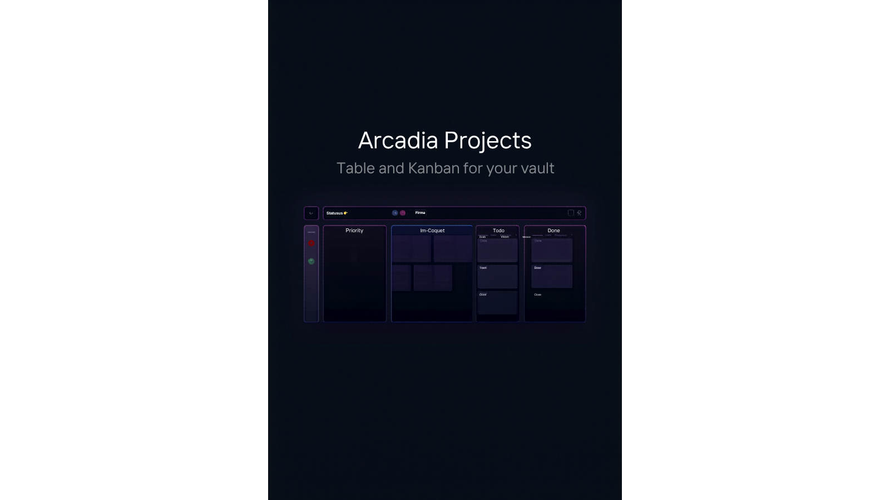

# Arcadia Projects

Arcadia Projects turns the notes you already have into a project board. Point it at a folder and it reads each note's YAML frontmatter to build a sortable table and a drag-and-drop Kanban board, no separate database and no duplicate task lists. Move a card and the plugin writes the new status straight back into the note's frontmatter, so your notes stay the single source of truth.




## Features

| Feature | Free | Premium |
| --- | :---: | :---: |
| Table view: sortable, filterable spreadsheet of your notes with frontmatter columns | Yes | |
| Kanban view: drag-and-drop board grouped by a status field | Yes | |
| Card move via right-click or long-press menu (works on mobile) | Yes | |
| Create notes directly from the board with valid frontmatter | Yes | |
| Live sync: vault edits update the views automatically | Yes | |
| Text filter across titles and properties | Yes | |
| Calendar view mapping notes to dates | | In development |
| Gallery view for image-rich collections | | In development |
| Timeline view for date-range planning | | In development |
| Portfolio view for high-level dashboards | | In development |
| Advanced filter and sort combinations with saved presets | | In development |
| CSV export of any view | | In development |

The current release ships the free Table and Kanban views. Premium views are in development and unlock automatically in upcoming releases for anyone with an active license. You can purchase and activate a license now at [arcadia-studio.lemonsqueezy.com](https://arcadia-studio.lemonsqueezy.com).

## Installation

The Community Plugins listing is pending review. Until it is approved, install with one of these methods:

### Manual install from GitHub releases

1. Download `main.js`, `manifest.json`, and `styles.css` from the latest [GitHub release](https://github.com/Arcadia-Studio/obsidian-arcadia-projects/releases)
2. Create the folder `.obsidian/plugins/arcadia-projects/` in your vault and copy the three files into it
3. Reload Obsidian, then enable Arcadia Projects under Settings > Community plugins

### BRAT

1. Install the [BRAT](https://obsidian.md/plugins?id=obsidian42-brat) plugin from Community plugins
2. In BRAT, choose "Add beta plugin" and enter `Arcadia-Studio/obsidian-arcadia-projects`
3. Enable Arcadia Projects under Settings > Community plugins

## Quick start

1. Open Settings > Arcadia Projects and set the project folder (for example `Projects/`)
2. Give each project note a `status` frontmatter field, for example:

   ```yaml
   ---
   status: in-progress
   due: 2026-07-01
   tags:
     - client-work
   ---
   ```

3. Click the layout-dashboard ribbon icon, or run the "Open project view" command
4. Switch between Table and Kanban with the tabs in the view, or with the "Switch to table view" and "Switch to kanban view" commands
5. Drag cards between Kanban columns to update a note's status. On mobile, long-press a card and pick "Move to" instead

## Settings

| Setting | Default | What it does |
| --- | --- | --- |
| Project folder | (empty) | Folder containing your project notes. Subfolders are included. |
| Status property | `status` | Frontmatter field used to group notes into Kanban columns. |
| Status values | `todo, in-progress, done` | Comma-separated list that defines the columns and their order. Notes with other values get their own column; notes without the field land in Uncategorized. |
| Date property | `due` | Frontmatter field used for due dates. |
| Default view | Table | View shown when the panel opens. |
| Card display fields | `status, due, tags` | Frontmatter fields shown on Kanban cards. |
| License key | (empty) | Premium license key. Click Validate to activate. |

## Pricing

Core features (Table and Kanban) are free, with no account and no license key required. Premium features require a one-time license from [arcadia-studio.lemonsqueezy.com](https://arcadia-studio.lemonsqueezy.com).

To activate: Settings > Arcadia Projects > License key > Validate. License checks are cached, and a previously activated license stays active when you are offline.

## Support

Questions, bug reports, and feature requests: open an issue on [GitHub](https://github.com/Arcadia-Studio/obsidian-arcadia-projects/issues) or email [arcadiastudio77@gmail.com](mailto:arcadiastudio77@gmail.com).

## License

The plugin code is released under the MIT license. See [LICENSE](LICENSE).
